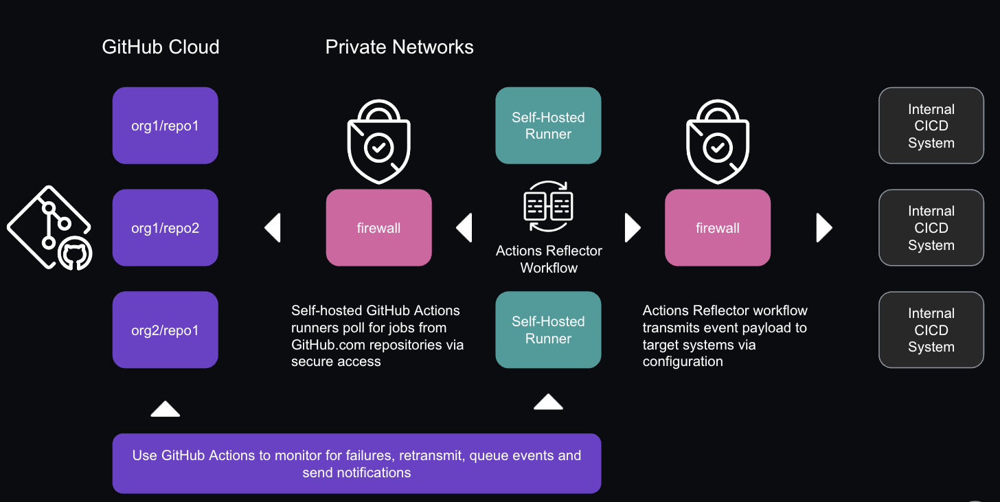

# GitHub Actions Reflector

GitHub Actions workflow meant to run on self-hosted runners to leverage internal or private tooling (such as CICD systems) with GitHub cloud-hosted repositories without the need to use reverse proxy implementations.

---

Example overview of an implementation which uses reverse proxy or an API gateway to allow webhook traffic from GitHub cloud repositories to internal systems.  In this setup, webhook events are sent from github.com to a reverse proxy or API gateway which are routed to an internal CICD system.  This example pattern becomes more complicated when adding additional reliability measures in place such as webhook notifications (success or failure), retransmissions and potentially a queueing mechanism at the API gateway layer to handle traffic bursts and scale as required.


---

Example overview of an implementation which uses the Actions Reflector workflow to route repository webhook events to internal systems.  Actions Reflector is executed as a GitHub Actions workflow from `on:` events such as `push:` or `pull_request:` on self-hosted runners, routing event payloads to downstream target systems.  This configuration leverages queueing, notification and retransmission capabilities of GitHub Actions and leverages self-hosted runners to prevent the need for ingress traffic initiation at a network edge.


## Usage

Example workflow for consuming reflector:

```yaml
name: reflector-call

on:
  push:

  pull_request:
  - main

jobs:
  reflector-call:
    # Path to reusable workflow
    uses: collinmcneese/github-actions-reflector/.github/workflows/reflector.yml@main
    with:
      targetUrl: 'http://172.17.0.1:8080/github-webhook/'
```

## TODO

- [ ] Complete documentation
- [ ] Add logic for handling secrets to downstream webhook targets
- [ ] Add code testing
- [ ] Add quick setup example references for easy testing
